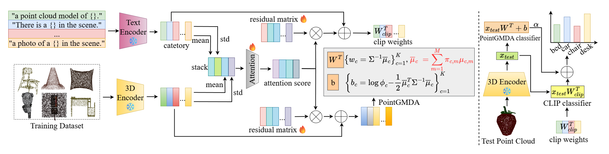

# <center> Multimodal 3D Few-Shot Classification via Gaussian Mixture Discriminant Analysis </center>
Implementation of Multimodal 3D Few-Shot Classification via Gaussian Mixture Discriminant Analysis, a few-shot framework designed for CLIP and other vision-language models.

## Introduction
We present PointGMDA, a training-free framework for few-shot point cloud classification that leverages Gaussian Mixture Models (GMMs) and Gaussian Discriminant Analysis (GDA) to model intra-class variability more effectively than traditional single-prototype methods. By estimating GMM parameters from support samples and constructing mixture-weighted prototypes, PointGMDA enables robust decision boundaries with analytical tractability. To incorporate semantic priors, we integrate CLIP-style textual prompts and fuse geometric and textual predictions through a hybrid scoring strategy. Additionally, we introduce PointGMDA-T, a lightweight attention-guided refinement module that learns residuals for fast feature adaptation under distribution shift. Extensive experiments on ModelNet40 and ScanObjectNN show that our method consistently outperforms strong baselines across various few-shot settings, demonstrating the effectiveness and generality of our probabilistic and multimodal framework.



## Requirements
### Installation
````bash
conda create -n PointGMDA python=3.10
conda activate PointGMDA

pip install -r requirements.txt

# Install the according versions of torch and torchvision
conda install pytorch torchvision cudatoolkit
````

### Dataset
+ [ModelNet40](https://modelnet.cs.princeton.edu/)
+ [ScanObjectNN](https://hkust-vgd.github.io/scanobjectnn/)

### Pre-trained model
+ [uni3d-b.pt](https://github.com/baaivision/Uni3D)
+ [penshape-pointbert-no-lvis.pt](https://github.com/Colin97/OpenShape_code)

## Get Started
### $full$-way $k$-shot
````bash
python run_evaluate.py
````
### $5$-way $1$-shot & $5$-shot
````bash
cd 
python few_shots.py --ckpt ckpt/uni3d-b.pt --config configs/scanobjectnn.yaml # or modelnet40.yaml
````
### $w$-way $k$-shot
````bash
python few_shots.py --model create_uni3d --npoints 2048 --clip-model ViT-H-16 --pc-model eva02_base_patch14_448 --pc-feat-dim 768 --evaluate_3d --ckpt_path ckpt/uni3d-b.pt --config configs/modelnet40.yaml # or modelnet40.yaml
````
## Acknowledgment
Our implementation is mainly based on the following codebase. We gratefully thank the authors for their wonderful works.
[PointGPT](https://github.com/CGuangyan-BIT/PointGPT),[APE](https://github.com/yangyangyang127/APE),[Cross-Modality-Feature-Fusion-Network](https://github.com/LexieYang/Cross-Modality-Feature-Fusion-Network),[A Hard-to-Beat Baseline for Training-free CLIP-Based Adaptation](https://github.com/mrflogs/ICLR24)